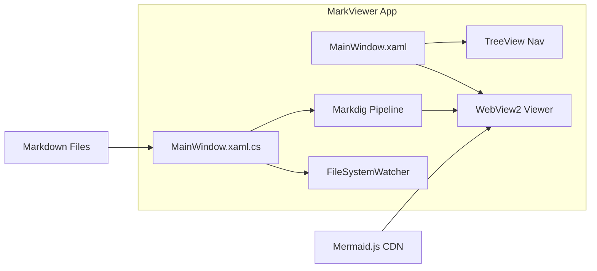
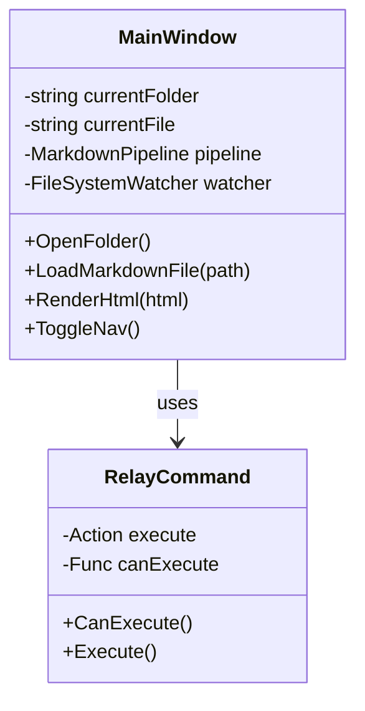
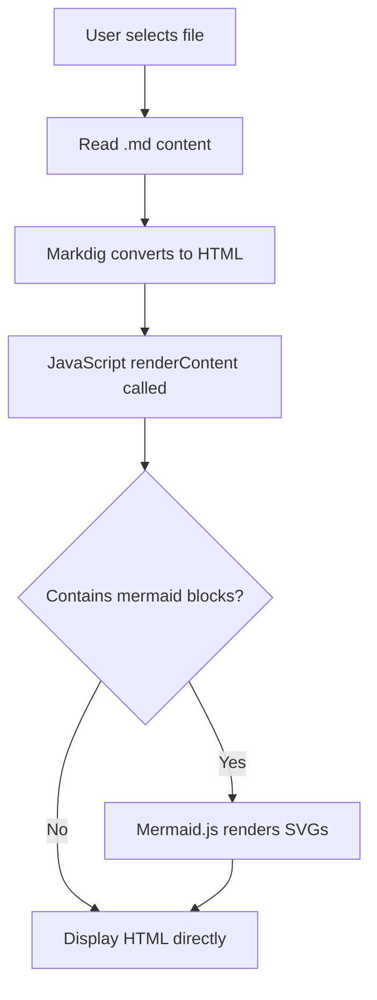

# Architecture

## System Overview

```mermaid
graph LR
    subgraph MarkViewer App
        A[MainWindow.xaml] --> B[TreeView Nav]
        A --> C[WebView2 Viewer]
        D[MainWindow.xaml.cs] --> E[Markdig Pipeline]
        D --> F[FileSystemWatcher]
    end

    G[Markdown Files] --> D
    E --> C
    H[Mermaid.js CDN] --> C
```

## Class Diagram

```mermaid
classDiagram
    class MainWindow {
        -string currentFolder
        -string currentFile
        -MarkdownPipeline pipeline
        -FileSystemWatcher watcher
        +OpenFolder()
        +LoadMarkdownFile(path)
        +RenderHtml(html)
        +ToggleNav()
    }

    class RelayCommand {
        -Action execute
        -Func canExecute
        +CanExecute()
        +Execute()
    }

    MainWindow --> RelayCommand : uses
```

## Data Flow

```mermaid
flowchart TB
    A[User selects file] --> B[Read .md content]
    B --> C[Markdig converts to HTML]
    C --> D[JavaScript renderContent called]
    D --> E{Contains mermaid blocks?}
    E -->|Yes| F[Mermaid.js renders SVGs]
    E -->|No| G[Display HTML directly]
    F --> G
```
