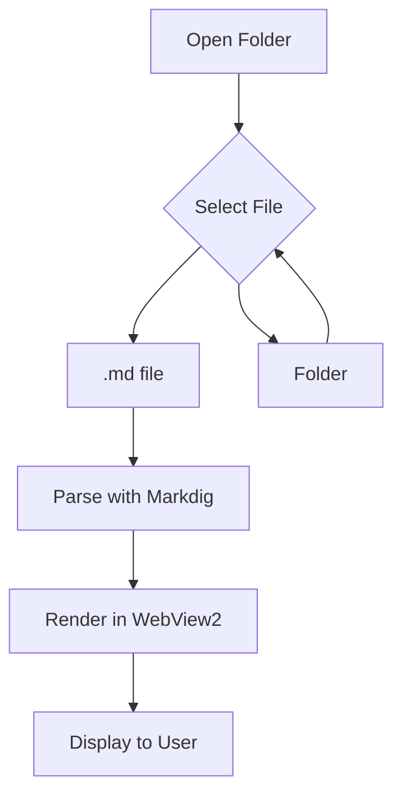
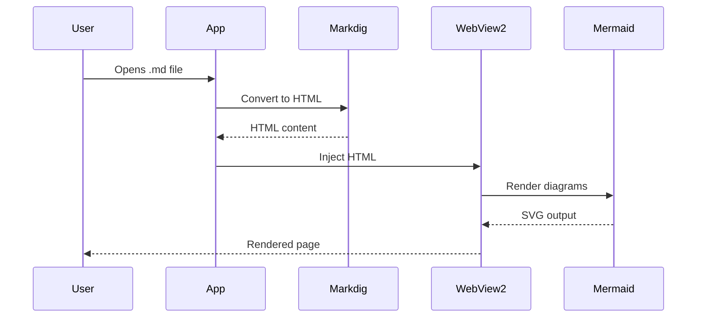

# Welcome to MarkViewer

This is a sample markdown file to test the viewer.

## Features

- **Folder navigation** with collapsible tree
- **Mermaid diagram** rendering
- **Live reload** when files change
- Dark theme optimized for reading

## Task List

- [x] Create WPF application
- [x] Add WebView2 for rendering
- [x] Integrate Markdig for markdown parsing
- [x] Add Mermaid.js support
- [ ] More features coming soon!

## Code Example

```csharp
public class HelloWorld
{
    public static void Main(string[] args)
    {
        Console.WriteLine("Hello from MarkViewer!");
    }
}
```

## Mermaid Flowchart



## Mermaid Sequence Diagram



## Table Example

| Feature | Status | Notes |
|---------|--------|-------|
| Markdown Rendering | ✅ | Via Markdig |
| Mermaid Diagrams | ✅ | Via Mermaid.js |
| Folder Navigation | ✅ | Collapsible tree |
| File Watching | ✅ | Auto-reload |
| Dark Theme | ✅ | VS Code inspired |

## Blockquote

> "The best way to predict the future is to invent it."
> — Alan Kay

---

*Enjoy using MarkViewer!*
